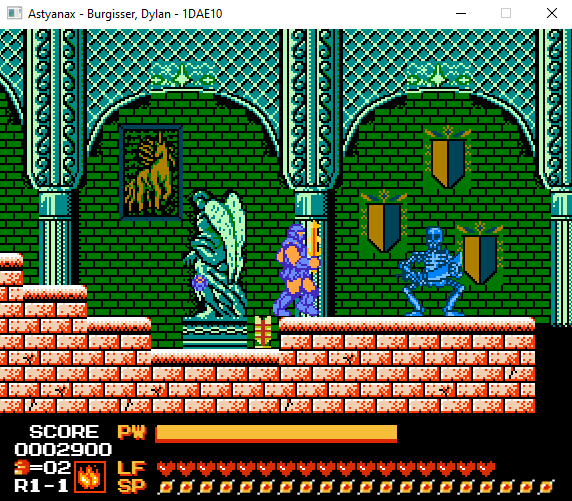

# Astyanax
This project is my first Solo game that I made in C++ based on the Game [Astyanax](https://en.wikipedia.org/wiki/The_Astyanax). See about my [version below](#astynax-the-game)

## Version 1.1
You can play it [here](https://github.com/DijiOfficial/Astyanax/releases/tag/v1.1) by downloading the .rar file.

You can also check out the [What's Next Section!](#what-is-next)

Press "i" or "esc" for the controls and enjoy!

## Astynax The Game

This game is a close replica of the Original Game Astyanax made for the Arcade and later NES, with small modifications.

## Core Mechanics

You will be playing as Astyanax the hero of this [Story](https://en.wikipedia.org/wiki/The_Astyanax), who is kidnapped by a fairy and transported to another dimension where he has to face the evil wizard Blackhorn and his armies who kidnapped the princess, the only person who can send him back to his world. 

In the original version you can [drop](#drops) (more on those later) a weapon mod which will automatically change your weapon to the next in the list of three. The Axe, Spear and Sword. And the only way to change weapon is to meet Cutie the fairy who kidnapped you or drop another wepon mod. See weapon effects bellow:

### Weapons

I changed this mechanic as to provide a more diverse gameplay experience. At the beginning you have the option of choosing between the three weapons and their effects have been altered slightly as having anything other than the Sword in the original is weaker.

Now, what does this table mean? You have two ways of dealing damage, physical and magical. Physical damage is simple, hit the [ennemies](#ennemies) with your [Weapon](#weapons), the damage dealt is calculated based on your current Strength * Physical Damage multiplier of your [Weapon](#weapons). Your current Strength is indicated by the yellow bar in the HUD. When you attack you have cooldown period during which your strength regenerates, attacking again when your strength is not at max will result in lower damage output.

To deal magical damage you first need to choose your [Spell](#spells) using "w" to switch Spell, the default one is the [Fireball](#fireball). Press "z" to cast a Spell, once again the damage dealt is calculated as follow: current Spell base damage * Spell damage multiplier of your [Weapon](#weapons). When you Cast a Spell you consume "Mana" starting with 20 points the Mana consumption is calculated as follow: Spell base mana cost * Spell cost multiplier of your [Weapon](#weapons).

### Spells

Now that you are versed in how to effectively murder the [ennemies](#ennemies), which Spells are available? You currently hace three spells available  the [Fireball](#fireball), the [Time Freeze](#time-freeze) and the [Lightning Bolt](#lightning-bolt). You can switch between them using "z" and cast them using "c".

The selected Spell will be shown by an icon in the bottom left corner of the HUD.

#### Fireball

The Fireball  is the default Spell when you start 

It's characteristics are as follow:
 - Base Damage of 25
 - Base Mana cost of 3
 - Shoots 8 FireBalls in a circle around the player
 - Each FireBall can deal damage but will be consummed after a hit
 - Effective in overwhelming situation

#### Time Freeze

The Time Freeze freezes everything for a couple of seconds.

It's characteristics are as follow:
 - Base Damage of 0
 - Base Mana cost of 1
 - Freezes everything except the player
 - Frozen [ennemies](#ennemies) cannot deal damage, but can still be damaged
 - Frozen projectiles won't deal damage and can be destroyed with physical attacks
 - Effective with the Spear [Weapon](#weapons) to run past the [ennemies](#ennemies)

#### Lightning Bolt

The Lightning Bolt last but not least is the most powerfull Spell but also the more costly choice.

It's characteristics are as follow:
 - Base Damage of 45
 - Base Mana cost of 5
 - Obliterates everything except the player
 - Always Effective

### Drops

You have already heard about the weapon mod drop from the [Core Mechanics](#core-mechanics) section, but what is it? It's origninally one of Five [Drops](#drops), which I removed in my version for a more diverse gameplay option.

The remaining 4 drops  are the [Strength](#strength) upgrade, the [Swing Speed](#swing-speed) upgrade, the [Health Potion](#potions) and the [Mana Potion](#potions). 

Drops are Pre-Generated in the [First Level](#first-level) and are represented by standing statues , when you break a statue one of the four drops will be "randomly" chosen. The "randomness" was tweaked to allow probabilities to influence the drop, in other words the more you need a health or mana potion the more likely you are to drop one where has if you have max health and mana you are guarenteed to drop one of the other two.

#### Strength

The Strengh upgrade will give an additional 5 strength points. Starting at 5 Strength points your character can have up to 20 maximum strenght points.

#### Swing Speed

The Swing Speed upgrade originally shortened the cooldwon between swings (according to the manual) which is completly useless since you could already swing fast enough to deal 0 damage. So instead it replenishes the strenght points faster. (There is currently no stop to how fast you can replenish)

#### Potions

The Health and Mana Potions are pretty self explanatory they will fully replenish your health or mana bar. 

### Ennemies

(section is comming)

### First Level

(Section is comming)

## What is Next?

I recently added the Pause Menu which features a scoreboard Option. So next up Is Adding A SCOREBOARD! Which will keep track of the highscores and automatically replace and rank them!

But Before I can add the ScoreBoard Players need the ability to finish the Game (duh), So First off will be the addition of the long awaited FINAL BOSS OF THE LEVEL 1!!!! (dun-dun-dun)

Finally I noticed I forgor to put the default strenght back to 5 so that will need yo be fixed as well.

There is also a list of known bugs which I may or may not tackle:
- Switching between Spells when Casting one may cause unwanted visual effects
- During Invincibility Frames the avatar sprite can switche weapons
- During Invincibility Frames the avatar with the Sword is cropped wrong when moving backwards on the X axis
- When Reseting the Enemies are not reset
- When Reseting the Game can Crash (not yet known why)

There is also a lot of erronous and 'bad' code that could be replaced, which I will likely never do, but instead port the game to a new engine with proper code (OMG ASTYNAX v2.0 coming Soon?)
